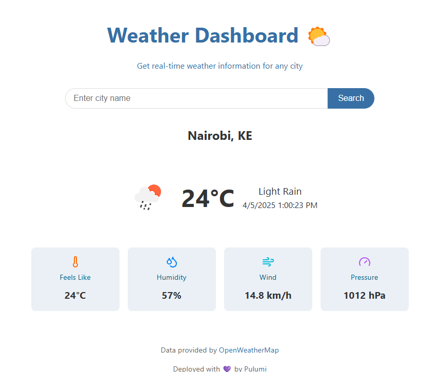

# kube-weather
A simple weather app built and deployed using pulumi static website template. This application runs on a microk8s kubernetes cluster locally.

## Usage
Simply visit this [site]() and search for a location whose weather information you want to fetch

## Screenshots

